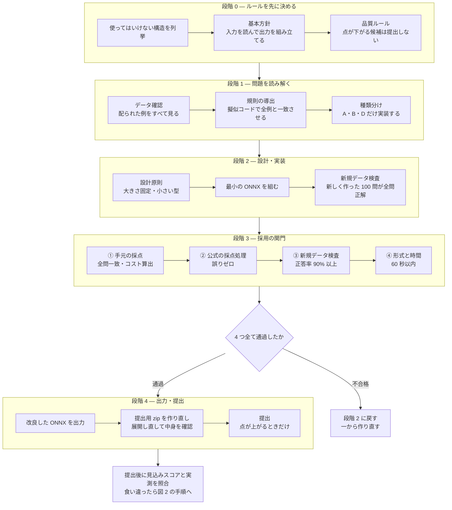
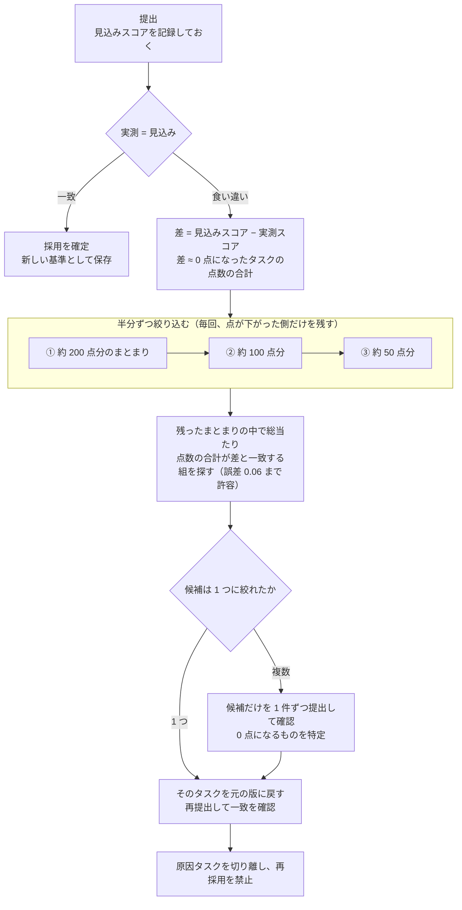

# neurogolf-solution

Kaggle コンペ [The 2026 NeuroGolf Championship](https://www.kaggle.com/competitions/neurogolf-2026) の解法一式。

## 公式最終結果

| 項目 | 内容 |
|---|---|
| 最終順位 | **2,963チーム中10位** |
| チーム名 | **Kimura@SeSDA & OverfitOracle** |
| 最終スコア | **8025.82** |
| 獲得メダル | **Competition Gold Medal** |

公式記録は、[Kaggle最終順位表](https://www.kaggle.com/competitions/neurogolf-2026/leaderboard)及び[木村竜輝のKaggleプロフィール](https://www.kaggle.com/kimura0415)で確認できる。

### スコア及び順位に関する注記

[`best_score.json`](best_score.json) の `score: 8025.43` は大会中に確認したスコアであり、`final_score: 8025.82` は最終集計後に確定した公式最終スコアである。そのため、本READMEでは大会の最終成績を **8025.82** と表記する。

なお、[`all_scores.csv`](all_scores.csv) はローカル採点環境でのタスク別測定記録であり、`score` 列の単純合計は **8025.1927** である。公式最終スコアの根拠には、上記のKaggle最終順位表を用いる。

### チーム成果と木村竜輝の担当範囲

本成果はチームによる成果であり、候補実装の作成には生成AI及びチーム内で作成・共有された候補も活用した。

木村竜輝は、最適化方針の策定、検証ゲートの設計、候補群の同一条件での検証と採否判断、Leaderboardの実測値とローカル投影値の乖離分析、採用候補の安全な統合及び最終提出物の構築を担当した。

したがって、本リポジトリが示す本人の担当は、すべての候補実装を単独で作成したことではなく、複数の候補を設計・検証・選別・統合し、最終結果へ結び付けたことである。生成AIを含む実装体制の詳細は、[`docs/orchestration.md`](docs/orchestration.md) に記載している。

本 README は、合計スコア 6347.82 から 8025.82 に至るまでに採用した方針とその根拠を記述する。

## 用語

本文で繰り返し使う言葉を先にまとめる。

| 用語 | 意味 |
|---|---|
| **ARC-AGI** | 色つきのマス目（グリッド）を別のマス目に変換する問題集。「入力の例」と「正しい出力の例」がいくつか与えられ、その変換規則を当てる |
| **ONNX** | 計算の手順を機械可読な形で書き表すためのファイル形式。ここでは「入力のマス目を受け取って出力のマス目を返す計算手順」を ONNX ファイルとして書く |
| **タスク** | 1 問のこと。本コンペでは 400 問ある |
| **コスト (cost)** | ONNX ファイルの「重さ」を表す数値。小さいほど高得点になる（定義は §1 参照） |
| **テンソル** | 計算の途中で扱う数値の配列。`[1,10,30,30]` は「10 種類 × 縦 30 × 横 30」の箱を意味する |
| **中間テンソル** | 入力でも出力でもない、計算の途中で作られる配列。これがコストの大半を占める |
| **one-hot 形式** | 色を表す方法の一つ。10 色を「10 枚の白黒シート」に分け、その色のマスだけを 1 にする |
| **ONNX Runtime (ORT)** | ONNX ファイルを実際に動かすソフトウェア。採点にも使われる |
| **LB (Leaderboard)** | Kaggle の公式順位表。提出すると本番のスコアが表示される |
| **手元の採点 / 見込みスコア** | 自分の PC で公式と同じ計算をしてスコアを予測したもの。本番と食い違うことがある |
| **非公開データ** | 参加者に配られない、採点だけに使われるデータ。ここで間違えると 0 点になる |
| **新規データ検査（fresh 検査）** | 問題の生成プログラムを自分で回して新しい問題を作り、それでも正しく解けるかを確かめる検査 |

## 1. 問題設定

各タスクについて、完全に正しく動く ONNX ファイルだけが得点する。

- **点数の決まり方**: `score = max(1, 25 - ln(cost))`、`cost = 定数の個数 + 中間テンソルが使うメモリ量(バイト)`
- **正しさ**: 配られた全ての例、および非公開データで、マス目が 1 つ残らず一致すること。部分点はない
- **制約**: 全ての配列の大きさを事前に固定する / 使用禁止の演算がある(Loop, Scan, NonZero, Unique, Script, Function) / 1 ファイル最大 1.44MB
- **入出力**: 入力は `[1,10,30,30]` の one-hot 形式、出力も同じ形

点数の式に `ln`（自然対数）が入っているため、**コストを約 2.7 分の 1 にして、ようやく 1 点上がる**。
言い換えると、数パーセントの節約では意味がなく、**10 分の 1、100 分の 1 という桁単位の削減**が必要になる。

## 2. 最終結果

**2963 チーム中 10 位、競技部門 金メダル**(2026 年 7 月 16 日授与)。


| 指標 | 開始時点 | 最終 |
|---|---|---|
| 合計スコア | 6347.82 | **8025.82** |
| コスト中央値 | 15,230 | **124.5** |
| コスト平均 | 29,727 | — |
| 最大コスト | 109,037 | **7,977** |
| cost ≤ 100 のタスク数 | — | **174 / 400** |

提出物: [submission.zip](submission.zip)(各タスク最大 1 ファイル `task001.onnx`〜`task400.onnx`)

## 3. 手法

### 3.1 設計方針: 学習させるのをやめ、規則を書き下す方式へ

当初はニューラルネットワークを学習させて変換を近似する方針だったが、これを捨てた。

コンペの掲示板を横断して分析した結果
([docs/research/discussion-methods-recent.md](docs/research/discussion-methods-recent.md))、
上位陣は学習済みモデルを使っていないことが分かった。
多くのタスクでは変換規則が全データで共通しているので、上位陣はその規則を
**学習パラメータを一切持たない計算手順**としてタスクごとに直接書き下していた。
学習させる方針は、掲示板でも失敗例が報告されていた。

そこで方針を「**問題の生成プログラムに書かれた規則を、そのまま計算手順に翻訳する**」に変更した。
配られた例は規則を確認するための材料であって、**例に合わせ込む対象ではない**と定義した。
この定義は §3.7 で述べる「見たことのないデータで動かない」問題の予防に直結する。

### 3.2 何がコストを食っているかの特定

公式の採点プログラムを読み込み、コストの内訳を確定した。

- `cost = 定数の個数 + 中間テンソルが使うメモリ量`
- **入力と出力は数えられない**。それ以外の計算途中の配列はすべて数えられる
- 各配列のメモリ量は `要素数 × 1 要素あたりのバイト数`。事前に宣言した大きさと実際の大きさの、**大きい方**が採られる
- グラフに埋め込んだ定数は、メモリではなく「定数の個数」として数えられる

ここから、コストのほとんどを占めているのは中間テンソルだと分かった。
`[1,10,30,30]` の配列を 32 ビット小数で持つと、**それ 1 個だけで 36,000 バイト**になる。
つまり **10 色分のシートを計算の途中で持つかどうか**が、コストのほぼ全てを決めていた。

### 3.3 コストを減らす 4 つの型

§3.2 の分析をもとに、削減手法を整理した
([docs/golf/ONNX_GOLF_PLAYBOOK.md](docs/golf/ONNX_GOLF_PLAYBOOK.md))。中心は次の 4 つである。

| 手法 | 内容 |
|---|---|
| **出力をタダにする** | 10 色分のシートを途中で作らず、「各マスの色番号」を書いた 1 枚のシートだけを持ち回る。最後に色番号を 10 枚に展開する演算を**出力そのもの**にすれば、出力は数えられないので 0 バイトで済む |
| **早い段階で 10 枚を 1 枚にまとめる** | 重み `[0..9]` の小さな畳み込みで、10 枚のシートを「色番号 1 枚」に変換する。以降の処理はすべて 1 枚のシート上で行う |
| **入力を上書きする** | 出力が「入力の一部を塗り替えただけ」のタスクでは、入力に直接塗る演算を使う。入力は数えられないので、途中の作業用配列がいらなくなる |
| **1 要素あたりのバイト数を減らし、早めに切り出す** | 白黒の印だけなら 1 バイト型で持ち、計算が必要な直前でだけ大きい型に広げる。問題の最大サイズまで切り出して処理し、最後に余白を足して元の大きさに戻す |

あわせて、実行環境（ORT 1.24）でどの型がどの演算に使えるかの対応表を作った。
1 バイト整数では足し算・掛け算ができないこと、色の展開演算に整数版がないことなどを先に確定させ、
試す前に候補から外した。

### 3.4 全タスク一括の書き換えと、その限界

第一段階として、全 400 タスクに**計算結果が変わらない書き換え**をまとめて適用した
([proposals/001](proposals/001-zero-risk-onnx-cost-reduction.md),
[002](proposals/002-residual-dtype-and-noop.md))。

- どこからも使われていない定数の削除、同じ内容の定数の統合
- どの演算も作らない、宣言だけ残った型情報の削除
- 何もしない演算（1 を掛ける、0 を足す、同じ形に変形するなど）の除去
- 減らして得になる配列だけを、より小さい型に変更

これらは正しさを保ったまま適用できるが、**得られたのは合計で約 +3 点だった**。
計算の構造そのものは変えていないので、対数の点数式のもとでは原理的にここが限界になる。
そこで第二段階として、タスクごとに構造から作り直す方針へ移った。

### 3.5 タスクごとの作り直しを自動化する

**1 タスクにつき 1 つのエージェント**を割り当てて、個別の作り直しを自動化した
([proposals/003](proposals/003-per-task-golf-factory.md),
[004](proposals/004-overnight-factory.md))。

処理待ちの列はコストの大きい順に並べ、タスクごとに資料（マス目の図・今のファイルの中身・目標コスト）を
自動生成して割り当てる。1 タスクあたりの手順を図 1 に示す。

**図 1. 単一タスクの改良手順**



図 1 の段階 3 を通った候補は「採用してよい」と判定されるが、
これはあくまで**自分の PC 上での判定**にすぎない。
最終的に正しさを決められるのは公式の順位表だけなので、
段階 4 で提出した後、見込みスコアと実測スコアが一致するかを必ず確かめる。
食い違ったときの原因の探し方は §3.7.2 で述べる。

#### 3.5.1 段階 0: ルールを先に決める

実装を始める前に、作ってはいけない構造を列挙した。
公式が受け付けないものに加えて、経験上、本番で失敗すると分かったものを含む。

| 区分 | 対象 |
|---|---|
| 公式が禁止している演算 | `Loop` `Scan` `NonZero` `Unique` `Script` `Function` |
| 経験から追加で禁止したもの | `Compress`、`*Sequence*` 系、入れ子構造、大きさが可変の配列、圧縮形式の定数 |
| 答えを丸暗記する構成 | 入力と出力の対応表を埋め込む `ArgMax` + `Gather` + `Scatter` の組み合わせ |

基本方針として「**入力を読み取り、そこから出力を組み立てる**」構成を必須にした。
これは丸暗記型の構成を作れなくするための制約で、§3.7.1 で述べる失敗の予防にあたる。

#### 3.5.2 段階 1: 問題の種類分け

規則を擬似コードとして確定させた後、実装しやすさの観点からタスクを 4 種類に分けた。

| 種類 | 内容 | 実装 |
|---|---|---|
| A | 各マスの近くだけを見て決まる変換 | 実装する |
| B | 回数の上限が決まっている繰り返し | 実装する |
| C | 図形のつながり方を全体で調べるもの | 実装しない |
| D | 全体の移動・回転・反転など | 実装する |

C 種類はどう作ってもコストが下がらない下限が高く、時間をかけても点が伸びないため対象から外した。

#### 3.5.3 段階 3: 採用の関門

次の 4 段すべてを通った候補だけを採用する。採用の経路はこれ 1 本だけで、他の手段は用意しない。

| 段 | 判定条件 |
|---|---|
| ① 手元の採点 (`scripts/lib/scoring`) | 配られた全ての例でマス目が完全一致し、コストが計算できる |
| ② 公式の採点処理 (`neurogolf_utils`) | 配られた全ての例で誤りが 0 件 |
| ③ 新規データ検査 | 生成プログラムで作った新しい問題で、正答率 90% 以上（危険なタスクは 95% 以上）。実行時エラー・異常な数値・出力の形の食い違い・判定が反転しうるきわどい値は 0 件であること |
| ④ 形式と時間 | ファイル形式の検査を通り、ORT が読み込めて、検証全体が 60 秒以内に終わる |

運用面では、次の 3 点を採った。

- **採用経路を 1 本に絞る**: 検証を通った ONNX ファイルだけが採用される。
  エージェントの自己申告や報告文からは採用できないようにした
- **全員の完了を待たない**: 全ワーカーが終わるまで待つ方式は待ち時間の無駄が大きく、
  作業が中断すると進捗を全部失う。終わったワーカーから順に次のタスクを渡す方式に変え、
  処理を作業セッションから切り離した
- **やめどきを決めておく**: どう工夫しても下回れない下限（例: ある種の畳み込みの出力 3,600 バイト）に
  達したら、そこから先は 400 バイト（約 +0.03 点）のために正しさを危険にさらすことになる。
  下限に届いた時点で打ち切ると決めた
  ([docs/golf/AGENT_LOOP_TASK_RULES.md](docs/golf/AGENT_LOOP_TASK_RULES.md))

### 3.6 検証を速く回せるようにする

自動化の速度を決めていたのは、ONNX の設計ではなく**候補を検証する時間**だった。
採用の関門では候補ごとに何度も採点し直すので、1 回の採点が遅いとその分だけ試行回数が減る。

そこで全 400 タスクについて採点にかかる時間を実測し、段階分けした
([docs/golf/task_scoring_times.csv](docs/golf/task_scoring_times.csv))。

| 所要時間 | タスク数 |
|---|---|
| 1 秒未満 | 313 |
| 1〜3 秒 | 47 |
| 3〜5 秒 | 15 |
| 5〜10 秒 | 12 |
| 10 秒以上 | 11 |
| 60 秒を超えて中断 | 2 |

中央値は 0.20 秒で、偏りが非常に大きい。
つまり**ごく少数のタスクが全体の時間を占めていた**ので、そこだけ直せば全体が速くなる。

#### 3.6.1 Einsum という演算の実行時間

遅さの主な原因は Einsum という演算だった。
Einsum は複数段の計算を 1 つの演算にまとめられるので、
まとめて消えた分の中間テンソルがコストから外れ、最後に置けばメモリ 0 も実現できる。
コストを減らす手段としては非常に有効である。

一方で Einsum は、**掛け合わせて足し込む順番によって、途中でできる配列の大きさが変わる**。
ORT は最も効率の良い順番を自動では選ばないため、
式に書いた入力の並び順がそのまま実行時間に表れる。
入力の数が増えると、手元の ORT が応答を返さなくなる（15 個以上で発生）ことも確認した。

以上から、次の 4 点をルールにした。

1. **Einsum をむやみに使わない。** 「コストが下がっても検証が遅い候補は採用しない」を
   判断の優先順位として明文化した。コストが低くても計測に時間がかかる構成は不採用とし、
   範囲を限定した処理や座標計算による直接生成に切り替える
   ([docs/golf/AGENT_LOOP_TASK_RULES.md](docs/golf/AGENT_LOOP_TASK_RULES.md) §2)。
2. **使うときは入力を並べ替える。** 大きな配列を小さな行列で左右から挟む並びにすると、
   各段階でできる途中の配列を小さく保てる。例として `'ra,ai,zcij,bj,sb->zcrs'` は
   大きい `zcij` を小さな変換行列で挟む形になっている。
   **同じ答えを出す式でも、並べ方を変えるだけで実行時間は桁違いに変わる。**
   あわせて入力の数も上限（15 個未満、実運用では 12 個未満）に抑えた。
3. **止まる候補は採点前に弾く。** 候補をまとめて調べるとき、
   ファイルを読み込んだ時点で入力 12 個以上、または式が 60 文字以上の Einsum を見つけて、
   採点対象から外す。1 件が止まっただけで全体が停止するのを防ぐためである。
   さらに全体に 600 秒の制限時間を設け、超えたらそこまでの結果を回収して打ち切る
   ([scripts/golf/harvest_others_safe.py](scripts/golf/harvest_others_safe.py))。
4. **関門そのものに時間制限を設ける。** 検証は 30 秒以内、
   手元の採点・公式の採点処理・新規データ検査の合計で実用上 60 秒以内とし、
   これを満たさない候補は「**時間内に測れないので採用しない**」と定義した。

この結果、コストが低くても検証に載らない候補は最初から候補にならなくなり、
1 タスクあたりの試行回数を確保できた。

### 3.7 「手元では正しいのに本番で 0 点」の分類と対策

中盤以降、点を失う主な原因は圧縮の失敗ではなく、
**手元の検証を通った候補が本番で得点しないこと**に移った。
これを 3 系統に分けたことが、対策を立てる前提になった
([docs/golf/ERROR_PATTERNS.md](docs/golf/ERROR_PATTERNS.md))。

| 系統 | 症状 | 対策 |
|---|---|---|
| **A: 採点処理そのものが失敗する** | 該当タスクだけでなく**提出ファイル全体が無効**になる。手元の検査を全て通っていても起きる | 事前には検知できない。エラー通知が該当タスクを名指しするので、そのタスクだけ元に戻して再提出する |
| **B: 非公開データで通用しない** | 提出は成立するが、見込みスコアを大きく下回る | 主な原因は、配られた例に合わせ込んでしまったことと、削りすぎたこと。生成プログラムで**新しく作ったデータでの全問一致検査**を必須にした |
| **C: 新規データ検査が誤って弾く** | 正しい候補が、わずかな失敗を理由に落とされる | 検査で落ちたことを「不正解の確定」ではなく**注意信号**として扱い、切り離して公式の順位表で実際に確かめる |

#### 3.7.1 配られた例に合わせ込んでしまう問題

配られた例に合わせ込んだ「場合分けの塊」のようなファイルは、
手元の検証を全て通っても非公開データで 0 点になり、実測で約 −15 点を失った。

以降は「規則を書き下すことに限定し、例への合わせ込みは禁止」を変えられないルールとし、
エージェントに**出どころの申告**（生成プログラムの規則から導いたのか、例を見て決めたのか）を義務づけた。
特定の座標・特定の色・物体の個数の決め打ちなど、
**生成プログラムから導けない定数**の使用を一律に禁止した。

#### 3.7.2 点が下がったときに原因のタスクを突き止める

§3.5.3 の関門を通った候補は、その時点では「採用してよい」と認定される。
しかしこの認定は自分の PC 上での判定であり、A・B 系統の失敗は事前に見つけられない。
そこで認定後は提出し、**見込みスコアと実測スコアが一致して初めて確定**とする。

食い違った場合、原因のタスクは本番で 0 点になり、見込んでいた点をまるごと失っている。したがって

```text
差 = 見込みスコア − 実測スコア ≒ 0 点になったタスクの点数の合計
```

が成り立つ。ここでいう「点数」は各タスクの `max(1, 25 - ln(cost))` である。
この関係を使った原因タスクの探し方を図 2 に示す。

**図 2. 提出後に原因タスクを突き止める手順**



手順は 2 段構えである。

**第 1 段: 点数の量で半分ずつ絞り込む。**
変更したタスクが多いと、点数が近い値に固まってしまい、組み合わせが 1 つに決まらない。
そこで変更したタスクを点数の合計で分割し、**約 200 点分 → 約 100 点分 → 約 50 点分**と
半分ずつ小さくしながら提出して、点が下がる側だけを残す。
各段で調べる対象が半分になるので、3 段で約 8 分の 1 に絞れる。

**第 2 段: 残ったまとまりの中で総当たり。**
絞り込んだ中で、変更したタスクの点数のあらゆる組み合わせを試し、
合計が差と一致するものを探す（誤差 0.06 まで許容）。
1 つに決まればそれが原因なので、元の版に戻して再提出し、一致することを確かめる。
複数残った場合だけ、その候補を 1 件ずつ提出して 0 点になるものを特定する。

実際の例を示す。

| 差 | 一致した点数 | 判定 | 結果 |
|---|---|---|---|
| 20.51 | ある 1 タスクの 20.51 | 1 つに決まった | 個別提出を 1 回も使わずに特定、元に戻して一致を確認 |
| 15.55 | ある 1 タスクの 15.542 | 1 つに決まった | そのタスクだけ元に戻して復旧 |
| 17.72 | ある 1 タスクの 17.72 | 1 つに決まった | 新規データ検査を通っていた候補が原因だった |
| — | コスト 400 前後に 4 件が密集（点数の差が 0.01 未満） | 複数 | 総当たりでは区別できず、4 件を 1 件ずつ提出して 1 件を特定 |

最後の例のとおり、点数が近い候補が同じまとまりに入っていると、総当たりでは 1 つに絞れない。
そのため第 1 段でまとまりを十分小さくしておくこと、
まとまりを作るときに点数の値を互いに離しておくことが前提になる。

特定した原因タスクは切り離し、以降の候補から除外して再び採用されないようにした。
また提出の手順を「安全版 → 冒険版 →（必要なら）修正版」の**最大 3 回**に固定した。
Kaggle は一番良い提出を残す仕組みなので、冒険版の点が下がっても順位表は悪化せず、判定だけが得られる。

### 3.8 環境側の不具合で、正しいのに 0 点になる

§3.7 の失敗はどれもファイル側に原因があるものだが、
これとは別に、**正しく動くファイルが 0 点になる**ことがあった。
原因は採点環境と手元の検証環境の不具合であって、ファイルの正しさとは関係がない。
これを「ファイルが間違っている」と解釈すると、正しい候補を捨て続けることになる。

#### 3.8.1 提出 zip の中の並び順で結果が変わる

最も影響が大きかったのは、**同じ ONNX ファイル群でも、zip の中の並び順だけでスコアが変わる**ことである
([docs/research/discussions/699840-order-sensitivity-bug.md](docs/research/discussions/699840-order-sensitivity-bug.md))。
単体や少数のまとまりでは正しく採点されるタスクが、大きなまとまりの後ろに置かれると 0 点になる。
同じ zip を 2 回提出して違うスコアが返ることもあった。

原因は主催者によって確認されている。
ORT は 1 つの処理の中で複数タスクを続けて採点する際、計算用の一時メモリを使い回す。
そのため、**設定を誤った畳み込み（付加値の個数が出力の枚数より少ないもの）が、
後から採点される全く正しいファイルを壊してしまう**。
つまり 0 点になったタスク自身には何の誤りもない。
これは仕様上、動作が保証されない使い方にあたり、主催者は修正しない方針を示している
(報告先: `microsoft/onnxruntime#28654`)。

対策は 2 つである。

1. **壊す側にならない。** 畳み込み系の演算を使う場合は、
   重み・付加値の個数・出力の枚数が一致していることを、採用前の必須確認項目にした
   ([docs/golf/AGENT_LOOP_TASK_RULES.md](docs/golf/AGENT_LOOP_TASK_RULES.md))。
   必要のない場合も、正しい個数の値を明示的に置く。
2. **壊される側にならない。** 並び順を変えただけでスコアが変わる候補は採用しない。
   また壊す兆候のあるファイル群は zip の末尾にまとめて置き、
   確定した末尾の並び順を以降の提出で固定した（`best_score.json` の `order_sensitive` に記録）。

#### 3.8.2 その他、環境が原因で正しいものを弾いてしまう例

| 事象 | 症状 | 対策 |
|---|---|---|
| 採点の順番によるエラー | エラーが特定のタスクではなく特定の**順番の位置**で再現する。その位置に何を置いても失敗する | 位置が原因だと判別できるので、ファイルを疑わず配置を変えて再提出する |
| PC の種類による小数計算の差 | 採点は出力が 0 より大きいかどうかで判定する。ぎりぎりの値の符号が Mac と Linux で逆になり、手元では不合格・本番では合格になるタスクが 6 件あった。手元の判定に従って差し替えていれば約 −8.6 点を失う見込みだった | 出力の値を 0〜0.25 のきわどい範囲に置かないことをルール化。手元で落ちたことだけを理由に候補を捨てない |
| 手元の実行結果が毎回変わる | 並列処理の影響で実行のたびに検証結果が揺れ、判定が逆転することがあった | 検証時は並列処理を使わない設定に固定した |
| 手元でコストが測れない | 一部タスクでコストが 0 と表示され、壊れたファイルだと誤解しかけた。実際には本番で正常に採点され得点する | 手元でコスト 0 と出たことだけを理由に捨てず、新規データ検査を通っていれば公式の順位表で確かめる |
| ORT の計算結果が壊れる | ある設定で繰り返し実行したときだけ、畳み込みの出力が壊れる。食い違いの一部はこれが原因の可能性がある | 疑わしい候補は 1 件だけ切り離して検証する |

以上から、**手元の環境で不合格になったことを最終判断にしない**方針を採った。
これは §3.7 の系統 C（新規データ検査が誤って弾く）と同じ構造で、
最終的に決められるのは公式の順位表だけ、という前提に行き着く。
なお §3.7.2 で原因タスクを特定したときも、切り離す前に本節の事象に当てはまらないかを確認している。

## 4. 結果

最終的にコストの中央値は 124.5 になり、400 タスクのうち 174 件がコスト 100 以下になった。
最もコストの大きいタスクでも 7,977 で、開始時点の最大値 109,037 から約 13.7 分の 1 である。
満点の 25.00（コスト 1 以下）に達したタスクも複数ある。

## 5. 考察

効いたのは個々の ONNX の小技そのものではなく、次の 3 点だったと考える。

1. **決める前に測ったこと。** §3.6 では、削る対象であるコストではなく
   検証にかかる時間を測ったことで、どこが全体の速度を決めているかが分かった。
   推測ではなく実測で対象を選んだことが、限られた時間の使い道を決めた。
2. **失敗を種類ごとに分けたこと。** §3.7 の 3 系統は原因も対策も違うので、
   検証を一律に厳しくするだけでは対処できない。分けたうえでそれぞれに別の手続き
   （新規データ検査 / 名指しされたタスクを戻す / 公式の順位表で確かめる）を割り当てたことが、
   終盤で点を失わずに済んだ理由である。
3. **手元で落ちたことを最終判断にしなかったこと。** §3.8 のとおり、
   0 点の原因がファイル側にあるとは限らない。ORT のメモリ使い回しによる並び順の問題では、
   0 点になったタスク自体は完全に正しい。手元で落ちた候補を機械的に捨てる運用では、
   この種の取りこぼしに気づけないまま正しい候補を捨て続けることになる。
   採用は慎重に、不採用は公式の順位表で再確認する、という非対称な運用が有効だった。

## 謝辞

本コンペティションにはチームとして参加した。
本人の担当範囲は、冒頭の「チーム成果と木村竜輝の担当範囲」に記載したとおりである。

最終提出後、チームメイトの jazivxt 氏より Kaggle Discussion 上で
"The credit for the gold is all yours @kimura0415 great work! You earned it!" とのコメントを受けた。


議論と検証環境を共有してくれたチームメイトに感謝する。

## リポジトリ構成

| パス | 内容 |
|---|---|
| `submission.zip` | 最終提出物(最終スコア 8025.82) |
| `all_scores.csv` | タスク別のコストとスコア |
| `best_score.json` | 最終提出の情報 |
| `scripts/` | 探索・統合・検証・採点のスクリプト群 |
| `scripts/golf/` | コスト削減・作り直しの実装 |
| `docs/` | 手法メモ・タスク別の資料・調査ノート |
| `docs/competition/` | コンペ概要・ルール |
| `others/` | 比較・統合に用いた候補プール。チーム内で共有された候補及び生成AI等に由来する候補を含み、本人単独作成物ではない |

### 主要ドキュメント

| ファイル | 内容 |
|---|---|
| [docs/golf/ONNX_GOLF_PLAYBOOK.md](docs/golf/ONNX_GOLF_PLAYBOOK.md) | コスト削減の手法集と、どの型がどの演算に使えるかの対応表 |
| [docs/golf/ERROR_PATTERNS.md](docs/golf/ERROR_PATTERNS.md) | 提出エラー・本番で通用しない事例の全パターンと復旧手順 |
| [docs/golf/BANNED_STRUCTURES.md](docs/golf/BANNED_STRUCTURES.md) | 使ってはいけない構造・演算の一覧 |
| [docs/golf/AGENT_LOOP_TASK_RULES.md](docs/golf/AGENT_LOOP_TASK_RULES.md) | 1 タスク改良の基本ルールと採用の関門(時間制限を含む) |
| [docs/golf/task_scoring_times.csv](docs/golf/task_scoring_times.csv) | タスク別の採点所要時間の実測と段階分け |
| [docs/golf/campaign.md](docs/golf/campaign.md) | 実行履歴とスコアの推移 |
| [docs/research/discussion-methods-recent.md](docs/research/discussion-methods-recent.md) | 上位陣の手法の分析(方針転換の根拠) |
| [docs/orchestration.md](docs/orchestration.md) | 提案 → 実装 → レビューの分担 |
| [proposals/](proposals/) | 各段階の提案書(方針・見込み・危険性・受け入れ基準) |

## ライセンス

コンペ規約に従い、公開時点で OSI ライセンス供与とみなされます(入賞時は Apache 2.0 でのオープンソース化が必要)。
