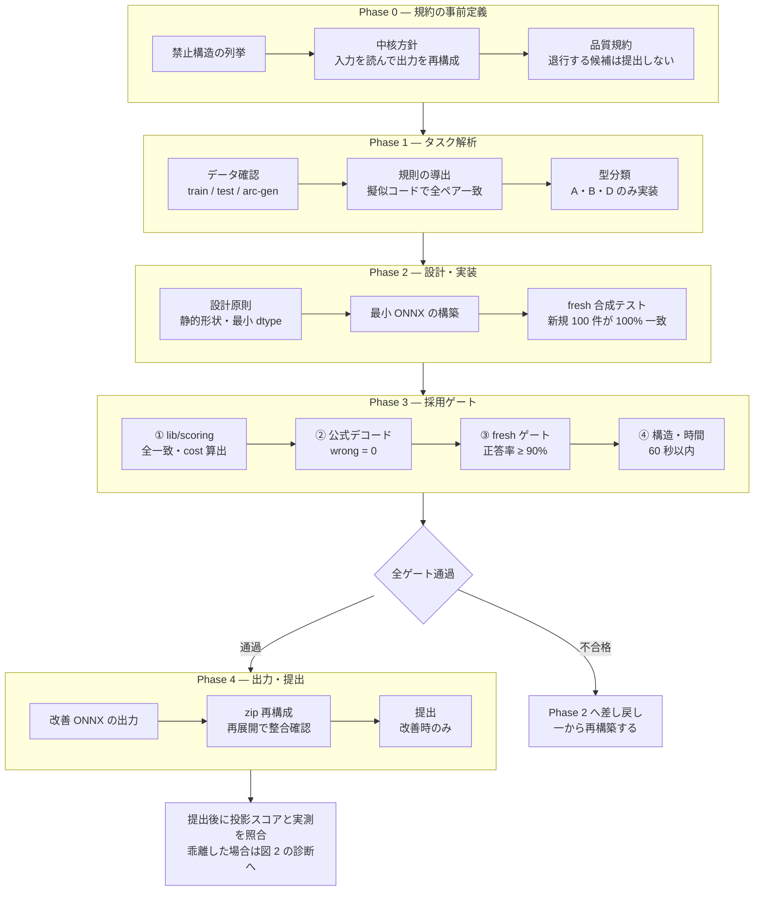
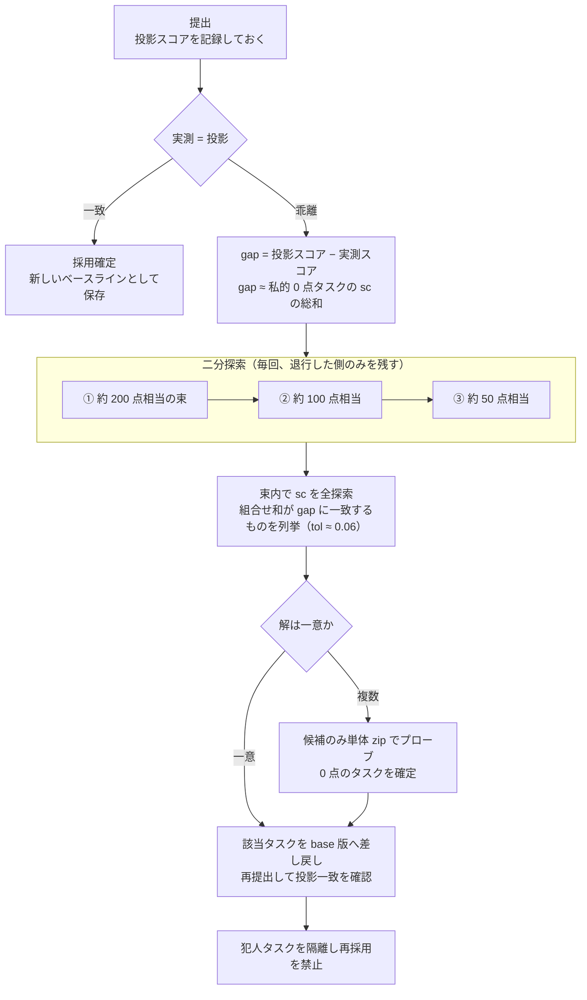

# neurogolf-solution

Kaggle コンペ [The 2026 NeuroGolf Championship](https://www.kaggle.com/competitions/neurogolf-2026) の解法一式。

## 公式最終結果

| 項目 | 内容 |
|---|---|
| 最終順位 | **2,963チーム中10位** |
| チーム名 | **Kimura@SeSDA & OverfitOracle** |
| 最終スコア | **8025.82** |
| 獲得メダル | **Competition Gold Medal** |

公式記録は、[Kaggle最終順位表](https://www.kaggle.com/competitions/neurogolf-2026/leaderboard)及び[木村竜輝のKaggleプロフィール](https://www.kaggle.com/kimura0415)で確認できる。

### スコア及び順位に関する注記

[`best_score.json`](best_score.json) の `score: 8025.43` は大会中に確認したスコアであり、`final_score: 8025.82` は最終集計後に確定した公式最終スコアである。そのため、本READMEでは大会の最終成績を **8025.82** と表記する。

### チーム成果と木村竜輝の担当範囲

本成果はチームによる成果であり、候補実装の作成には生成AI及びチーム内で作成・共有された候補も活用した。

木村竜輝は、最適化方針の策定、検証ゲートの設計、候補群の同一条件での検証と採否判断、Leaderboardの実測値とローカル投影値の乖離分析、採用候補の安全な統合及び最終提出物の構築を担当した。

したがって、本リポジトリが示す本人の担当は、すべての候補実装を単独で作成したことではなく、複数の候補を設計・検証・選別・統合し、最終結果へ結び付けたことである。生成AIを含む実装体制の詳細は、[`docs/orchestration.md`](docs/orchestration.md) に記載している。

ARC-AGI の各タスク変換を再現する「できるだけ小さい」ニューラルネットを ONNX で作り、
`score(task) = max(1, 25 - ln(cost))`(cost = パラメータ数 + メモリフットプリント)を最大化する。

本 README は、合計スコア 6347.82 から 8025.82 に至るまでに採用した方針とその根拠を記述する。

## 1. 問題設定

各タスクについて、機能的に正しい ONNX グラフのみが得点する。

- **評価指標**: `score(task) = max(1, 25 - ln(cost))`、`cost = パラメータ数 + 中間テンソルのメモリ(bytes)`
- **正しさ**: `train` + `test` + `arc-gen` の全ペアおよび非公開ベンチマークで全セル完全一致。部分点は存在しない
- **制約**: 全テンソル静的形状 / 禁止オペ(Loop, Scan, NonZero, Unique, Script, Function) / 1 ファイル最大 1.44MB
- **入出力**: 入力は `[1,10,30,30]` の one-hot、出力は同形状のマスク

指標が `ln` を含むため、cost を e 倍(約 2.718 倍)削減して初めて 1 点が得られる。
すなわち有意な改善には定数倍ではなく**オーダー単位の削減**が要求される。

## 2. 最終結果

**2963 チーム中 10 位、競技部門 金メダル**(2026 年 7 月 16 日授与)。


| 指標 | ベースライン | 最終 |
|---|---|---|
| 合計スコア | 6347.82 | **8025.82** |
| コスト中央値 | 15,230 | **124** |
| コスト平均 | 29,727 | — |
| 最大コスト | 109,037 | **7,977** |
| cost ≤ 100 のタスク数 | — | **174 / 400** |

提出物: [submission.zip](submission.zip)(各タスク最大 1 ファイル `task001.onnx`〜`task400.onnx`)

## 3. 初期分析

最適化に着手する前に、現状のコスト分布を測定した。ベースラインの平均コストは 29,727、
中央値は 15,230 であった。一方、上位帯のスコアから逆算される平均コストは約 314 であり、
本解法のグラフは **50〜100 倍のコスト超過**にあると判定した。

この差分は差分最適化では到達不能な規模である。§1 で述べたとおり指標は対数であるため、
全タスクにわたる構造再設計が必要であるという結論を得た。

なお、スコアラ実装の誤りによる見かけ上のギャップである可能性も検討したが、
既に 25.00 点に到達しているタスクが存在したことから、
スコアラは正しく動作しており圧縮率のみが不足していると確認した。

## 4. 手法

### 4.1 設計方針: 学習ベースから仕様コンパイルへ

当初はニューラルネットを学習させてタスク変換を近似する方針を採っていたが、これを破棄した。

コンペの Discussion を横断的に分析した結果
([docs/research/discussion-methods-recent.md](docs/research/discussion-methods-recent.md))、
上位帯は学習済みモデルを使用しておらず、多くのタスクで変換が全データにわたり定数的であることを利用して、
**ゼロパラメータの純関数型テンソルプログラム**をタスクごとに記述していることが判明した。
学習ベースの試行は同 Discussion 上でも失敗が報告されている。

以上より、方針を「**タスク生成器の仕様をコンパイルする**」に変更した。
可視例は仕様の確認に用いるフィクスチャであり、フィッティングの対象ではないと定義した。
この定義は §4.7 で述べる汎化失敗の抑止にも直結する。

### 4.2 コスト構造の分析

公式スコアラの実装を精読し、コストの内訳を確定した。

- `cost = パラメータ数 + 中間テンソルのメモリ`
- **`input` および `output` は計上されない**。それ以外のノード出力テンソルはすべて計上される
- 各テンソルのメモリは `要素数 × dtype バイト数` であり、静的宣言値と ORT 実測値の**大きい方**が採用される
- initializer はメモリではなくパラメータ数として計上される

この構造から、支配項は中間テンソルであると特定した。
float32 の `[1,10,30,30]` 中間テンソルは 1 個で 36,000 バイトを占めるため、
**10 チャンネルの one-hot を中間に保持するか否か**がコストのほぼ全体を決定する。

### 4.3 コスト削減パターン

§4.2 の分析に基づき、削減手法を類型化した
([docs/golf/ONNX_GOLF_PLAYBOOK.md](docs/golf/ONNX_GOLF_PLAYBOOK.md))。中核は以下の 4 つである。

| 手法 | 内容 |
|---|---|
| **出力の無料化** | 10ch one-hot を実体化せず、単一チャンネルのラベル格子を保持し、終端の `Equal(lab, arange)` を**グラフ出力そのもの**とする。出力は非計上のため 0 バイトとなる |
| **チャンネルの早期集約** | 重み `[0..9]` の 1×1 Conv により 10ch を色 ID の 1ch 格子へ縮約し、空間処理はすべて `[1,1,H,W]` 上で行う |
| **入力への上書き** | 出力が入力の部分改変であるタスクでは `Where(mask, color, input)` を用いる。`input` は非計上のため中間バッファが不要となる |
| **dtype 縮小と早期クロップ** | マスクは bool / uint8 とし、算術を要する op の直前でのみ int32 / fp16 に拡張する。生成器のサイズ上限までクロップして処理し、終端で `Pad` により復元する |

併せて、実行環境(ORT 1.24 + `ORT_DISABLE_ALL`)における dtype / op のサポート行列を作成した。
1 バイト整数の算術カーネルが存在しないこと、`OneHot` に整数カーネルが存在しないこと等を事前に確定させ、
探索空間から除外した。

### 4.4 グラフ変換による一括最適化とその限界

第一段階として、全 400 タスクに対し**数値的挙動を変えない変換**を一括適用した
([proposals/001](proposals/001-zero-risk-onnx-cost-reduction.md),
[002](proposals/002-residual-dtype-and-noop.md))。

- 未使用 initializer の削除、同一 initializer の統合
- どのノードも生成しない stale な `value_info` の削除
- no-op ノード(`Mul×1`, `Add±0`, 同形 Reshape, Identity)の除去
- 正味の利得が正となるテンソルに限定した FP16 / BOOL 化

これらは正しさを保証したまま適用できるが、**利得は合計で +3 点程度に留まった**。
グラフの構造そのものを変更しないため、対数指標の下では原理的に限界がある。
したがって第二段階としてタスク単位の構造再設計へ移行した。

### 4.5 タスク別最適化の自動化

**1 タスク = 1 エージェント**の構成で個別最適化を自動化した
([proposals/003](proposals/003-per-task-golf-factory.md),
[004](proposals/004-overnight-factory.md))。

キューは cost 降順で構成し、タスクごとにブリーフ(グリッド可視化・現ネットの解剖・目標コスト)を生成して
ワーカーに割り当てる。1 タスクあたりの手順を図 1 に示す。

**図 1. 単一タスクの改良ワークフロー**



図 1 の Phase 3 を通過した候補は「採用可」と判定されるが、
この判定はあくまでローカル環境上のものである。
最終的な正しさの判定器は LB のみであり、
Phase 4 の提出後に投影スコアと実測スコアが一致するかを必ず照合する。
乖離した場合の原因特定手順は §4.7.2 で述べる。

#### 4.5.1 Phase 0: 規約の事前定義

実装に先立ち、生成してはならない構造を列挙した。
公式バリデータが棄却するものに加え、経験的に本番環境で失敗が確認された構造を含む。

| 区分 | 対象 |
|---|---|
| 公式の禁止オペ | `Loop` `Scan` `NonZero` `Unique` `Script` `Function` |
| 経験則による追加禁止 | `Compress`、`*Sequence*` 系、ネストグラフ、動的形状、`sparse_initializer` |
| 暗記型構成 | 入出力対応表を埋め込む `ArgMax` + `Gather` + `Scatter` の組合せ |

中核方針として「**入力テンソルを読み、そこから出力を再構成する**」構成を要求した。
これは暗記型の構成を構造的に排除するための制約であり、§4.7.1 で述べる汎化失敗の抑止に対応する。

#### 4.5.2 Phase 1: 型分類

規則を擬似コードとして確定させた後、実装可能性の観点からタスクを 4 型に分類した。

| 型 | 内容 | 実装 |
|---|---|---|
| A | 局所変換 | 実装する |
| B | 有界反復 | 実装する |
| C | 大域トポロジ(連結成分・到達可能性など) | 実装しない |
| D | 大域再配置・幾何変換 | 実装する |

C 型はコストの構造的下限が高く、投入時間に対する利得が小さいため対象から除外した。

#### 4.5.3 Phase 3: 採用ゲート

以下の 4 段をすべて通過した候補のみを採用する。単一の昇格経路であり、これ以外の採用手段は設けない。

| 段 | 判定条件 |
|---|---|
| ① `scripts/lib/scoring` (`require_correct=True`) | train / test / arc-gen の全ペアが完全一致し、cost が算出できる |
| ② 公式 `neurogolf_utils` デコーダ | train / test / arc-gen いずれも `wrong = 0` |
| ③ fresh ゲート | 生成器による新規データで `k > 0`、正答率 ≥ 90%(高リスク帯は ≥ 95%)。実行時エラー・非有限値・出力 shape 不一致・境界値(0, 0.25)は 0 件が必須 |
| ④ 構造・時間 | `onnx.checker` と shape inference を通過し、ORT がロードでき、検証全体が 60 秒以内に完了する |

運用設計上、以下の 3 点を採用した。

- **昇格経路の単一化**: 検証を通過した ONNX ファイルのみが採用される。
  ワーカーの自己申告や報告文には採用経路を設けない
- **バリア同期の廃止**: 全ワーカーの完了を待つウェーブ方式は待機時間の損失が大きく、
  またセッション終了時に全進捗を失う。終了したワーカーから順次次タスクを割り当てる連続キュー方式とし、
  プロセスをセッションから分離した
- **停止条件の明文化**: f32 Conv 出力 `[1,1,30,30]` = 3,600 バイトのような**構造的下限**に到達した場合、
  以降の削減は 400 バイト(約 +0.03 点)の利得に対して正しさのリスクを負うことになる。
  下限到達時点で打ち切ることを規約とした
  ([docs/golf/AGENT_LOOP_TASK_RULES.md](docs/golf/AGENT_LOOP_TASK_RULES.md))

### 4.6 検証スループットの最適化

自動化の律速はグラフ設計ではなく**候補の検証時間**であった。
採用ゲートは gold 全一致・マージン・fresh 監査を候補ごとに実行するため、
採点時間はワーカーの試行回数に直接影響する。

全 400 タスクの採点所要時間を実測し、階層化した
([docs/golf/task_scoring_times.csv](docs/golf/task_scoring_times.csv))。

| 階層 | タスク数 |
|---|---|
| fast (< 1s) | 313 |
| light (1–3s) | 47 |
| medium (3–5s) | 15 |
| heavy (5–10s) | 12 |
| very_heavy (≥ 10s) | 11 |
| TIMEOUT (> 60s) | 2 |

中央値は 0.20 秒であり、分布は著しく偏っている。
すなわち総時間は少数のタスクによって支配されている。

#### 4.6.1 Einsum の実行時間特性

低速化の主因は Einsum であった。Einsum は複数段の演算を単一ノードに畳み込めるため、
除去されたノードの中間テンソルが計上対象から外れ、終端に配置すれば memory 0 も達成できる。
コスト面では有効な手法である。

一方で Einsum は**縮約順序によって中間テンソルの大きさが決まる**。
ORT は最適な縮約順を自動選択しないため、オペランドの並び順がそのまま実行時間に反映される。
オペランド数が増加した場合はローカル ORT がハングする事象も確認された(15 個以上で発生)。

以上より、次の 4 点を規約とした。

1. **Einsum の使用を抑制する。** 「コストが低下しても検証が遅い候補は採用しない」を評価順序として明文化した。
   低コストであっても測定が長時間化する構成は不採用とし、
   ROI / 座標ベース / ルールベースの直接生成に切り替える
   ([docs/golf/AGENT_LOOP_TASK_RULES.md](docs/golf/AGENT_LOOP_TASK_RULES.md) §2)。
2. **使用時はオペランドを並べ替える。** 大きなテンソルを小さな因子で左右から挟む配置とすることで、
   各段の中間テンソルを小さく保つ。例として `'ra,ai,zcij,bj,sb->zcrs'` は
   大きい `zcij` を remap 行列で挟む構成である。
   **同一の結果を与える式であっても、オペランドの並び順により実行時間はオーダー単位で変化する。**
   併せてオペランド数も上限(< 15、実運用では 12 未満)に制限した。
3. **ハングする候補を採点前に静的に除外する。** 候補プールの走査時に、
   グラフのロード時点でオペランド数 ≥ 12 または equation 長 ≥ 60 の Einsum を検出し、
   採点対象から分離する。1 候補のハングによりプール全体が停止することを防ぐためである。
   加えてプール全体に 600 秒の予算を設定し、超過時は部分結果を回収して打ち切る
   ([scripts/golf/harvest_others_safe.py](scripts/golf/harvest_others_safe.py))。
4. **採用ゲートに時間制限を設ける。** 検証は 30 秒以内、
   ローカル検証・公式デコード・fresh 監査の合計で実用上 60 秒以内とし、
   これを満たさない候補は「**測定不能につき採用不可**」と定義した。

この結果、コストが低くても検証に載らない候補は探索対象から除外され、
1 タスクあたりの反復回数が確保された。

### 4.7 汎化失敗の分類と対策

中盤以降、損失の主因は圧縮の失敗ではなく、
**ローカル検証を通過した候補が本番環境で得点しない事象**に移行した。
これを 3 系統に分離したことが対策の前提となった
([docs/golf/ERROR_PATTERNS.md](docs/golf/ERROR_PATTERNS.md))。

| 系統 | 症状 | 対策 |
|---|---|---|
| **A: グレーダー処理エラー** | 該当タスクのみならず**提出 zip 全体が無効化**される。ローカルの全ゲートを通過しても発生する | 事前検知は不可能。エラー通知が該当タスクを名指しするため、当該タスクのみベースへ戻して再提出する |
| **B: 非公開ベンチとの乖離** | 提出は成立するが投影スコアを大きく下回る | 主因は可視例へのフィッティングおよび高コスト帯の過剰削減。生成器から**新規生成したデータでの全一致検証**(fresh ゲート)を必須化した |
| **C: fresh ゲートの誤判定** | 正しい候補が少数の失敗により棄却される | fresh の棄却を確定診断ではなく**リスク信号**として扱い、隔離して LB 上で実測判定する |

#### 4.7.1 可視例へのフィッティングの検出

可視例に適合させた決定木型のネットは、ローカル検証を全通過した場合でも
非公開ベンチマークで 0 点となり、実測で約 −15 点の損失を生じた。

以降、「仕様コンパイル限定・例フィット禁止」を不変規程とし、
ワーカーに provenance(仕様由来か否か)の申告を義務づけた。
座標定数・色定数・オブジェクト数の固定など、
**生成器から導出できない定数**の使用を一律に禁止した。

#### 4.7.2 退行時の原因タスク特定

§4.5.3 の採用ゲートを通過した候補は、その時点で「採用可」と認定される。
しかしこの認定はローカル環境における判定であり、A / B 系統の失敗は事前検知できない。
したがって認定後は提出し、**投影スコアと実測スコアの一致をもって初めて確定**とする。

乖離した場合、原因タスクは本番で 0 点となり、見込んでいたスコアを全損する。したがって

```text
gap = 投影スコア − 実測スコア ≒ 私的 0 点となったタスクの sc の総和
```

が成立する。`sc` は各タスクの新スコア `max(1, 25 - ln(cost))` である。
この関係を用いた原因タスクの特定手順を図 2 に示す。

**図 2. 提出後の原因タスク特定フロー**



手順は二段構成である。

**第一段: スコア質量による二分探索。**
変更集合が大きい場合、`sc` の分布が密集して組合せ解が一意に定まらない。
そこで変更集合をスコアの総量で分割し、**約 200 点相当 → 約 100 点相当 → 約 50 点相当**と
順に半減させながら提出して、退行が再現する側のみを残す。
各段で探索対象は半分になり、3 段で母集団は約 1/8 に絞られる。

**第二段: 束内での `sc` 全探索。**
絞り込んだ束に対し、変更タスクの `sc` の全組合せを列挙し、
和が `gap` に一致するものを探す(`itertools.combinations`、許容誤差 `tol ≈ 0.06`)。
解が一意であればそのタスクが原因であり、base 版へ差し戻して再提出し、投影一致を確認する。
解が複数残る場合のみ、該当候補を単体 zip として個別に提出し、0 点となるものを確定する。

実測例を以下に示す。

| gap | 一致した `sc` | 判定 | 結果 |
|---|---|---|---|
| 20.51 | `sc(89) = 20.51` | 一意 | プローブ 0 回で単独犯を特定、差し戻して投影一致 |
| 15.55 | `sc = 15.542` | 一意 | 当該タスクのみ差し戻して復旧 |
| 17.72 | `sc(1458) = 17.72` | 一意 | fresh ゲートを通過していた候補が単独犯であった |
| — | cost 400 前後に 4 件が密集(`sc` 差 < 0.01) | 複数 | 全探索では分離できず、4 件を単体プローブして 1 件を特定 |

最後の例が示すとおり、`sc` が近接する候補が同一の束に含まれると全探索は一意解を返さない。
このため第一段の二分探索で束を十分に小さくしておくこと、
および束を構成する際に `sc` の値を互いに離すことが前提となる。

特定した原因タスクは隔離し、以降の候補プールから除外して再採用を防いだ。
また提出手順を「安全版 → リスキー版 →(必要に応じて)修正版」の**最大 3 提出**に固定した。
Kaggle は最良提出を保持するため、リスキー版が下振れした場合も LB は毀損せず、判定のみが得られる。

### 4.8 環境側の不具合による偽陰性

§4.7 で述べた失敗はいずれもネット側に原因があるものだが、
これとは別に、**正しく動作するネットが 0 点になる事象**が存在した。
原因は採点環境およびローカル検証環境の不具合であり、ネットの正しさとは無関係である。
これらを「ネットが誤っている」と解釈すると、正しい候補を捨て続けることになる。

#### 4.8.1 ZIP メンバー順序による汚染

最も影響が大きかったのは、**同一の ONNX 群であっても zip 内の並び順のみでスコアが変化する**事象である
([docs/research/discussions/699840-order-sensitivity-bug.md](docs/research/discussions/699840-order-sensitivity-bug.md))。
単体および小さい束では正しく採点されるタスクが、大きい束の後方に配置されると 0 点となる。
同一の zip を二度提出して異なるスコアが返る場合もあった。

根本原因は主催者により確認されている。
ORT は 1 プロセス内で複数タスクを採点する際にスクラッチパッドメモリを再利用するため、
**bias 長が出力チャネル数より短い不正な Conv が、後続の完全に正しいモデルを汚染する**。
すなわち 0 点になったタスク自身には何の誤りもない。
これは仕様上の未定義動作を踏むものであり、主催者は修正しない方針を示している
(upstream: `microsoft/onnxruntime#28654`)。

対策は 2 点である。

1. **加害側にならない。** Conv 系オペを使用する場合、
   weight・bias 長・出力チャネル数の一致を採用前の必須チェック項目とした
   ([docs/golf/AGENT_LOOP_TASK_RULES.md](docs/golf/AGENT_LOOP_TASK_RULES.md))。
   必要のない場合も、正しい長さのゼロ bias を明示的に置く。
2. **被害側にならない。** 並び順のみで採点結果が変わる候補は採用しない。
   また汚染の兆候を持つモデル群は zip の末尾に隔離配置し、
   確定した末尾順序を以降の提出で固定した(`best_score.json` の `order_sensitive` に記録)。

#### 4.8.2 その他の環境起因の偽陰性

| 事象 | 症状 | 対策 |
|---|---|---|
| グレーダーのバッチ位置依存エラー | エラーが特定のタスクではなく特定の**位置**で再現する。当該位置に置かれたモデルが何であっても失敗する | 位置起因と判別できるため、モデル側を疑わず配置を変更して再提出する |
| 浮動小数点閾値のプラットフォーム差 | 採点は raw 出力を `> 0` で閾値化する。境界値の符号が macOS arm64 と Linux で反転し、ローカルで不合格・本番で合格となるタスクが 6 件存在した。ローカル判定に従って置換していれば約 −8.6 点の毀損となる見込みであった | 生出力を `(0, 0.25)` の範囲に置かないことをマージン条件として規約化。ローカル不合格のみを根拠に候補を棄却しない |
| ローカル ORT の非決定性 | スレッド並列により実行ごとに検証結果が揺れ、判定が反転する事例があった | 検証セッションを `intra_op_num_threads=1` / `inter_op_num_threads=1` に固定した |
| ローカルスコアラの測定不能 | 一部タスクで cost が 0 と表示され、縮退したネットと誤認される。実際には本番で正常に採点され得点する | ローカルの `cost=0` のみを根拠に棄却せず、fresh ゲートを通過していれば LB で実測判定する |
| ORT の Conv 出力破損 | `ORT_DISABLE_ALL` でのループ推論時に限り Conv 出力が破損する。乖離タスクの一部はこれが原因である可能性がある | 疑わしい候補は単体で隔離検証する |

以上より、**ローカル環境の否定的判定を最終判断としない**方針を採った。
これは §4.7 の系統 C(fresh ゲートの誤判定)と同じ構造であり、
唯一の判定器は LB であるという前提に帰着する。
なお §4.7.2 で原因タスクを特定した際も、隔離の前に本節の事象に該当しないかを確認している。

## 5. 結果

最終的にコスト中央値は 124、400 タスク中 174 件が cost ≤ 100 に到達した。
最大コストのタスクも 7,977 であり、ベースラインの最大値 109,037 から約 13.7 倍の削減となる。
スコア 25.00(cost ≤ 1)に到達したタスクも複数存在する。

## 6. 考察

本解法において支配的であったのは、個々の ONNX 最適化手法そのものではなく、
以下の 3 点であったと考える。

1. **測定を方針決定に先行させたこと。** §3 のコスト分布測定により、
   差分最適化では到達不能であることを早期に確定させ、構造再設計へ資源を集中できた。
   同様に §4.6 では、コストではなく検証時間を測定したことが律速の特定につながった。
2. **失敗を系統ごとに分離したこと。** §4.7 の 3 系統は原因も対策も異なり、
   単一の検証強化では対処できない。分離したうえで各々に個別の手続き
   (fresh ゲート / 名指しタスクの差し戻し / LB による隔離判定)を割り当てたことが、
   終盤の損失抑制に寄与した。
3. **ローカルの否定的判定を最終判断としなかったこと。** §4.8 のとおり、
   0 点の原因がネット側にあるとは限らない。ORT のメモリ再利用に起因する zip 順序汚染では、
   0 点になったタスク自体は完全に正しい。ローカルで落ちた候補を機械的に棄却する運用は、
   この種の偽陰性を検出できないまま正しい候補を捨て続けることになる。
   採用側は保守的に、棄却側は LB で再確認するという非対称な運用が有効であった。

## 謝辞

本コンペティションにはチームとして参加した。
本 README に記した方針の策定・実装・運用は筆者(`@kimura0415`)が担当している。

最終提出後、チームメイトの jazivxt 氏より Kaggle Discussion 上で
"The credit for the gold is all yours @kimura0415 great work! You earned it!" とのコメントを受けた。


議論と検証環境を共有してくれたチームメイトに感謝する。

## リポジトリ構成

| パス | 内容 |
|---|---|
| `submission.zip` | 最終提出物(最終スコア 8025.82) |
| `all_scores.csv` | タスク別 cost / score |
| `best_score.json` | 最終提出のメタ情報 |
| `scripts/` | スキャン・マージ・検証・スコアリングのスクリプト群 |
| `scripts/golf/` | ONNX ゴルフ(コスト削減・リビルド)の実装 |
| `docs/` | 手法メモ・タスク別ブリーフ・調査ノート |
| `docs/competition/` | コンペ概要・ルール |

### 主要ドキュメント

| ファイル | 内容 |
|---|---|
| [docs/golf/ONNX_GOLF_PLAYBOOK.md](docs/golf/ONNX_GOLF_PLAYBOOK.md) | コスト削減パターン集と ORT dtype/op サポート表 |
| [docs/golf/ERROR_PATTERNS.md](docs/golf/ERROR_PATTERNS.md) | 提出エラー・非公開乖離の全パターンと復旧手順 |
| [docs/golf/BANNED_STRUCTURES.md](docs/golf/BANNED_STRUCTURES.md) | 使用不可の構造・オペレータの確定リスト |
| [docs/golf/AGENT_LOOP_TASK_RULES.md](docs/golf/AGENT_LOOP_TASK_RULES.md) | 単一タスク改良の基本ルールと採用ゲート(時間制限含む) |
| [docs/golf/task_scoring_times.csv](docs/golf/task_scoring_times.csv) | タスク別の採点所要時間の実測と階層分け |
| [docs/golf/campaign.md](docs/golf/campaign.md) | ウェーブ単位の実行履歴とスコア推移 |
| [docs/research/discussion-methods-recent.md](docs/research/discussion-methods-recent.md) | 上位帯の手法メタ分析(方針転換の根拠) |
| [docs/orchestration.md](docs/orchestration.md) | 提案 → 実装 → レビューの分業構造 |
| [proposals/](proposals/) | 各フェーズの提案書(戦略・期待効果・リスク・受け入れ基準) |

## ライセンス

コンペ規約に従い、公開時点で OSI ライセンス供与とみなされます(入賞時は Apache 2.0 でのオープンソース化が必要)。
